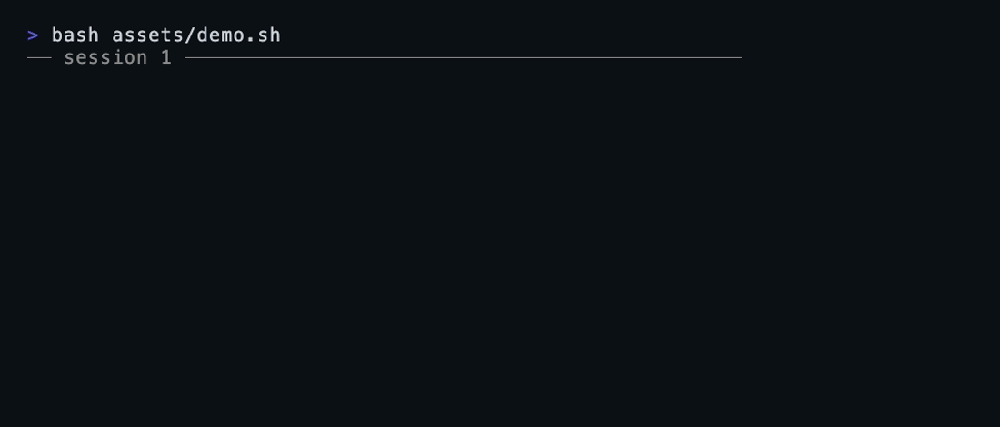

<h1 align="center">never-again</h1>

<p align="center"><b>Your coding agent keeps making the same mistakes. <code>never-again</code> makes sure it doesn't.</b></p>

<p align="center">It detects your real mistakes from the session transcript, turns each into a one-line rule,<br/>and recalls them every session — so the same mistake never happens twice. Just markdown + hooks.</p>

<p align="center">
  
</p>

<p align="center">
  <a href="LICENSE"></a>
  
  
</p>

---

Coding agents are brilliant and forgetful. They make a mistake, you correct it, and three sessions later they
make the **exact same one** — because nothing carried the lesson forward. `never-again` closes that loop, and
unlike the alternatives it does it with **nothing but markdown files and two hooks** — no database, no API
call, no vector store, no background daemon.

A lesson is just one line — dated, tagged, with the *why* attached so it can be applied with judgment:

```
- 2026-06-21 [git] Never force-push several repos in one session — trips GitHub's anti-abuse flag.
- 2026-06-21 [react][video] Animate in canvas/WebGL, not DOM — captureStream can't record DOM/CSS animations.
```

## Install

```
/plugin marketplace add othmarodev/claude-lessons
/plugin install never-again@claude-lessons-marketplace
```

That's it — the skill and both hooks (auto-capture + auto-recall) are now active.

<details>
<summary>Manual install (skill + recall only, no auto-capture hook)</summary>

```bash
git clone https://github.com/othmarodev/claude-lessons.git
cp -r claude-lessons/skills/never-again ~/.claude/skills/
mkdir -p ~/.claude/never-again && cp claude-lessons/templates/LESSONS.md ~/.claude/never-again/LESSONS.md
# optional: enable the hooks by adding claude-lessons/hooks/hooks.json's entries to ~/.claude/settings.json
```
</details>

## How it works

```
   ┌── DETECT (automatic) ──────────────────────────────────────────┐
   │  a Stop hook scans the finished session for rework signals      │
   │  (you said "no/revert/again", a file rewritten 3+ times,        │
   │   a command errored) → stages candidates in the INBOX           │
   └───────────────────────────────┬────────────────────────────────┘
                                   ▼
      CURATE   you keep the real, generalizable ones · discard noise
                                   ▼
      RECALL (automatic)   a SessionStart hook injects the ledger every session
                                   ▼
      APPLY    the matching rule is consulted before it would bite again
```

The detector finds the **signal**; you supply the **judgment** (phrasing + keep/discard). Capture is
automatic, but the ledger stays curated and lean instead of filling with machine noise.

Lessons live in two tiers, both auto-injected: a **global** ledger (`~/.claude/never-again/LESSONS.md`) for
rules true everywhere, and a **per-project** ledger (`<project>/.claude/never-again/LESSONS.md`) for one
codebase, so quirks never leak across projects.

## How it compares

| | capture | dependencies | growth control |
|---|---|---|---|
| **never-again** | **automatic** (transcript) **+ curated** | **none** — markdown + hooks | built-in: dedupe, generalize, graduate, prune |
| compiler / extractor tools | automatic | Agent SDK + background process | often unbounded |
| `claude-mem`-style memory | automatic | database / server | indexed, heavier |
| manual `learnings.md` convention | **manual** (you must notice) | none | up to you |
| raw `CLAUDE.md` | manual | none | bloats and gets ignored |

The niche `never-again` owns: **automatic capture without surrendering token discipline or shipping a
database, an API, or a daemon.** `cat ~/.claude/never-again/LESSONS.md` is the entire engine.

## Why it stays a net win (not bloat)

A memory that only grows is a tax on every session. `never-again` makes consolidation the core mechanic, not
an afterthought: one line per lesson, merge near-duplicates, generalize specifics into a single rule,
**graduate** rock-solid rules into `CLAUDE.md` and drop them from the ledger, and prune the obsolete. The
ledger is meant to be readable in under a minute — if it isn't, it gets compressed, not extended.

## What it is *not*

- **Not perfect detection.** It surfaces candidates from clear signals; *you* decide what's a real lesson.
  Expect to discard most candidates — that's the bar staying high, not the tool failing.
- **Not a token-savings guarantee.** The honest, demonstrable win is **not repeating rework**. Token savings
  are a secondary, conditional effect (recall costs a little every session) — real only when the ledger stays
  lean and lessons recur.
- **Not a replacement for `CLAUDE.md`, linters, or tests.** Those are *better* memory when a rule can be
  enforced mechanically — so `never-again` *graduates* rules into them once they're solid.

## Requirements

- Claude Code (plugin or manual install).
- `python3` (standard on macOS/Linux) for the auto-capture detector. Without it, auto-capture is skipped and
  manual capture + recall still work — recall is pure bash and always works.

## Configuration

Everything is plain markdown you can edit by hand. Tune detection sensitivity in `hooks/detect-rework.py`
(`CORRECTION_RE`, `MAX_CANDIDATES`, `TAIL_MESSAGES`). Tune capture/consolidation behaviour in the skill's
`SKILL.md` and `references/consolidation.md`.

## Contributing

Issues and PRs welcome — especially real lessons that generalize well and tuning to the detector so the inbox
stays high-signal.

## License

[MIT](LICENSE).
